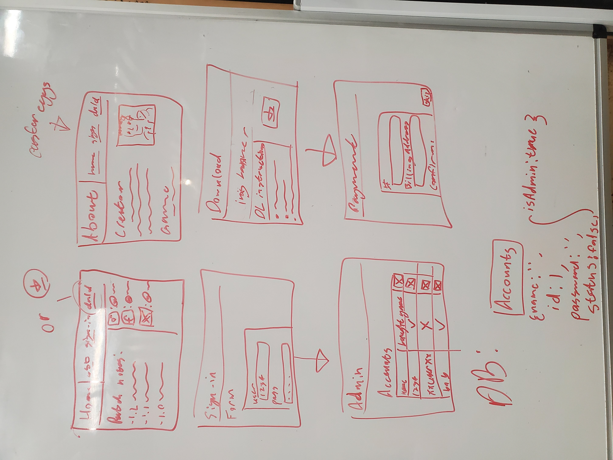

# One Wacky Week Download Site

A website that will likely be used in the future for selling the video game I want to make.

## description

The Home/Landing, About, and Admin pages will all have a Navbar for going between pages
- There will always be a `sign-in` button, will be replaced with the user's username upon login.
- The Navbar will have a `download` button until the user "pays" for the game.
- The about/home button will say `about` while on the Home page, but will say `home` while on the about or the admin page.

The Home/Landing page is the first page that a user will see
- It will have a Navbar which will have links to the about page, the download page, and the sign-in page.
- The games patch notes will be displayed on the page from most recent to oldest.
- The creator's socials will be displayed, since all I have and use is Discord, it will be the only listed social.

